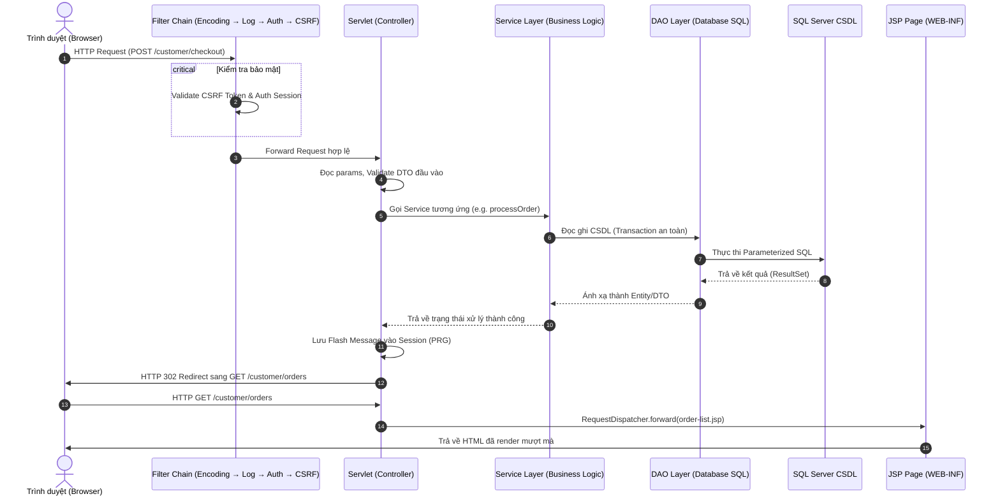

# 📁 FruitMkt — Hệ Thống Bán Hoa Quả Online Toàn Diện

[](file:///README.md)
[-blue.svg?style=for-the-badge)](file:///README.md)
[](file:///README.md)

Chào mừng bạn đến với **FruitMkt**, nền tảng thương mại điện tử chuyên biệt dành cho thị trường hoa quả online. Dự án được phát triển theo mô hình phân lớp chuẩn công nghiệp, tối ưu hóa trải nghiệm người dùng trên cả 5 vai trò hệ thống, tích hợp thanh toán tự động VietQR (SePay Webhook) và bảo mật nghiêm ngặt.

Tài liệu này đóng vai trò là **Source of Truth** (Cẩm nang tối cao) hướng dẫn kiến trúc, sơ đồ chức năng, quy định viết code và quy trình Git phối hợp nhóm nhằm triệt tiêu xung đột (conflict) và trùng lặp mã nguồn.

---

## 🗺️ BẢN ĐỒ DỰ ÁN & MỤC LỤC
1. [🏗️ Kiến Trúc Hệ Thống & Luồng Request](#-kiến-trúc-hệ-thống--luồng-request)
2. [⚙️ Cài Đặt Hệ Thống & Tech Stack](#%EF%B8%8F-cài-đặt-hệ-thống--tech-stack)
3. [👥 5 Vai Trò & Phân Hệ Chức Năng (Platform Scope)](#-5-vai-trò--phân-hệ-chức-năng-platform-scope)
4. [🛠️ Bộ Quy Tắc Code Tránh Trùng Lặp (DRY Rules)](#%EF%B8%8F-bộ-quy-tắc-code-tránh-trùng-lặp-dry-rules)
5. [🤝 Quy Trình Phối Hợp Git & Quản Trị Nhóm (Anti-Conflict Workflow)](#-quy-trình-phối-hợp-git--quản-trị-nhóm-anti-conflict-workflow)
6. [🎓 Hướng Dẫn Nộp Bài & Bảo Vệ Đồ Án](#-hướng-dẫn-nộp-bài--bảo-vệ-đồ-án)

---

## 🏗️ KIẾN TRÚC HỆ THỐNG & LUỒNG REQUEST

Dự án áp dụng mô hình **MVC (Model-View-Controller) phân lớp sâu**, tách biệt rạch ròi giữa Giao diện, Xử lý nghiệp vụ và Tương tác Cơ sở dữ liệu.

### 1. Phân Lớp Kiến Trúc
*   **View (JSP/JSTL)**: Đặt toàn bộ trong [web/WEB-INF/jsp](file:///d:/DMHoang/Project_GitHub/Ban_hoa_qua_online/web/WEB-INF/jsp) để chặn truy cập trực tiếp từ URL. Sử dụng các Custom Tags tự tạo (`ft:currency`, `ft:stars`, `ft:orderStatus`, `ft:pagination`, `ft:allow`) để triệt tiêu mã Java (Scriptlets `<% %>`) trên giao diện.
*   **Controller (Jakarta Servlet 6.0)**: Tiếp nhận Request từ Client, điều phối kiểm tra bảo mật (Filter), chuyển đổi kiểu dữ liệu và gọi Service tương ứng. Thực hiện nghiêm ngặt mô hình **PRG (Post-Redirect-Get)** để chống F5 lặp lại giao dịch.
*   **Service Layer**: Lớp chứa 100% logic nghiệp vụ xử lý tính toán tiền, kiểm tra tồn kho, tích hợp bên thứ ba (Google OAuth, SePay Webhook, Email Sender).
*   **DAO Layer (Data Access Object)**: Nơi duy nhất được phép chứa các câu lệnh SQL Server. Sử dụng JDBC thuần với kết nối Pooling qua JNDI, thực thi qua `PreparedStatement` và try-with-resources để bảo vệ an toàn tài nguyên kết nối.

### 2. Luồng request chi tiết (Request Lifecycle)



---

## ⚙️ CÀI ĐẶT HỆ THỐNG & TECH STACK

Để hệ thống hoạt động mượt mà và đồng bộ trên máy của tất cả các thành viên, cần cấu hình đúng các thông số sau:

### 1. Thông số Kỹ thuật Yêu cầu
*   **JDK Version**: JDK 17 trở lên (Hỗ trợ JDK 25 tốt nhất).
*   **Web Server**: Apache Tomcat 10.1.x (Hỗ trợ Jakarta Servlet API 6.0).
*   **Database**: Microsoft SQL Server 2019 / 2022.
*   **Build Tool**: Apache Ant (Tự động tích hợp sẵn trong NetBeans).

### 2. Thư viện yêu cầu (.jar)
Tất cả các file thư viện dạng `.jar` phải được đặt đồng bộ trong thư mục `web/WEB-INF/lib/` bao gồm:
*   `mssql-jdbc-12.6.1.jre11.jar` (Kết nối cơ sở dữ liệu SQL Server)
*   `jakarta.servlet.jsp.jstl-3.0.1.jar` + `jakarta.servlet.jsp.jstl-api-3.0.0.jar` (Bộ tag JSTL thế hệ mới)
*   `jbcrypt-0.4.jar` (Thư viện mã hóa băm mật khẩu bảo mật cao)
*   `jackson-databind-2.17.0.jar` + dependency (Jackson xử lý JSON API mượt mà)
*   `jakarta.mail-2.0.1.jar` (Gửi Email thông báo tự động)

### 3. Cấu hình Cơ sở dữ liệu
Mọi cấu hình liên quan đến DB phải được tập trung duy nhất tại file [DBConfig.java](file:///d:/DMHoang/Project_GitHub/Ban_hoa_qua_online/src/java/com/fruitmkt/config/DBConfig.java):
```java
public class DBConfig {
    public static final String DB_HOST     = "localhost";
    public static final String DB_PORT     = "1433";
    public static final String DB_NAME     = "OnlineFruitShopping";
    public static final String DB_USER     = "sa";
    public static final String DB_PASSWORD = "YOUR_DATABASE_PASSWORD_HERE"; // Thay thế bằng mật khẩu cá nhân
}
```
> [!WARNING]
> **TUYỆT ĐỐI KHÔNG** commit mật khẩu thật của bạn lên các nhánh chính. Mọi thành viên cần giữ nguyên file `DBConfig.java` local và cấu hình bỏ qua commit bằng lệnh:
> `git update-index --assume-unchanged src/java/com/fruitmkt/config/DBConfig.java`

---

## 👥 5 VAI TRÒ & PHÂN HỆ CHỨC NĂNG (PLATFORM SCOPE)

Nền tảng được cấu hình chi tiết phân hệ nghiệp vụ cho **5 đối tượng tương tác**, đáp ứng tối đa tính bảo mật và trải nghiệm người dùng.

### 🧭 1. Khách Vãng Lai (Guest)
*   **Khám Phá**: Xem danh sách hoa quả, tìm kiếm theo tên, lọc đa năng (theo danh mục, khoảng giá, số sao đánh giá).
*   **Trải Nghiệm Trực Quan**: Xem chi tiết sản phẩm với slide hình ảnh con, chọn mua theo nhiều biến thể trọng lượng (500g, 1kg, 2kg) và tùy chọn đóng gói cao cấp.
*   **Giỏ Hàng Động**: Quản lý giỏ hàng thông minh bằng JavaScript `localStorage` giúp thêm, sửa, xóa mặt hàng cực mượt mà không cần tải lại trang.
*   **Mua Hàng Nhanh**: Đặt hàng trực tiếp không cần đăng ký tài khoản (Guest Checkout), hệ thống tự động sinh tài khoản ảo và gửi email thông tin đăng nhập cho khách.
*   **Xác Thực**: Đăng ký và đăng nhập hệ thống, hỗ trợ **Google OAuth 2.0 Đăng nhập nhanh một chạm**.

### 🛍️ 2. Khách Mua Hàng (Customer)
*   **Tài Khoản**: Quản lý hồ sơ cá nhân, lưu trữ tối đa 5 địa chỉ nhận hàng tiện lợi.
*   **Đồng Bộ Giỏ Hàng**: Tự động đồng bộ giỏ hàng từ `localStorage` lên CSDL SQL Server ngay sau khi đăng nhập thành công.
*   **Danh Sách Yêu Thích**: Thêm sản phẩm vào Wishlist, dễ dàng chuyển đổi nhanh từ danh sách yêu thích vào giỏ hàng.
*   **Thanh Toán Trực Tuyến**:
    *   Thanh toán khi nhận hàng (COD).
    *   Thanh toán bằng **Dynamic VietQR**: Tạo mã QR động chứa chính xác số tiền đơn hàng và nội dung chuyển khoản tự động khớp lệnh.
*   **Theo Dõi Đơn Hàng**: Xem lịch sử mua sắm, hiển thị Timeline lộ trình giao hàng thời gian thực, nhấn nút nhận hàng thành công.
*   **Sau Bán Hàng**: Đánh giá sản phẩm kèm bình luận và hình ảnh thực tế (1 - 5 sao). Tạo yêu cầu đổi trả hoặc hoàn tiền trong vòng 7 ngày nếu quả bị dập nát.

### 🚜 3. Chủ Cửa Hàng (Shop Owner)
*   **Quản Lý Gian Hàng**: Quản trị danh sách hoa quả của shop (Thêm mới, Chỉnh sửa, Ngưng bán, Ẩn sản phẩm tạm thời).
*   **Quản Lý Biến Thể**: Thiết lập linh hoạt giá tiền và số lượng kho cho từng trọng lượng hoa quả, cấu hình nhãn dán cao cấp (Organic, Imported).
*   **Báo Động Kho Hàng**: Hệ thống tự động gửi thông báo in-app đỏ nổi bật khi số lượng tồn kho của một loại quả giảm xuống dưới 5.
*   **Xử Lý Đơn Hàng**: Xem danh sách đơn, chấp nhận duyệt đơn (Approved) hoặc từ chối đơn hàng kèm lý do chi tiết (sẽ tự động hoàn trả số tồn kho tức thì).
*   **Chiến Dịch Khuyến Mãi**: Tạo mã giảm giá (Coupon), cấu hình thời gian khuyến mãi theo mùa vụ và thiết lập khung giờ vàng Flash Sale.
*   **Thống Kê Kế Toán**: Biểu đồ doanh thu tương tác trực quan bằng thư viện **Chart.js** thể hiện tăng trưởng theo tuần/tháng/năm.

### 🚚 4. Nhân Viên Giao Hàng (Delivery Staff)
*   **Nhận Đơn**: Giao diện Dashboard hiển thị danh sách các đơn hàng đã được chủ shop duyệt và đóng gói trong khu vực phụ trách.
*   **Cập Nhật Lộ Trình**: Cập nhật trạng thái giao vận nhanh chóng (Đang giao hàng, Đã giao thành công, Giao thất bại kèm lý do).
*   **Chốt Đơn**: Xác nhận hoàn tất thu hộ tiền COD đối với các đơn hàng trả sau.

### 👑 5. Quản Trị Viên (Admin)
*   **Duyệt Shop**: Xét duyệt hồ sơ đăng ký kinh doanh của các cửa hàng hoa quả đăng ký mới.
*   **Kiểm Duyệt Nội Dung**: Quản lý toàn bộ sản phẩm trên sàn, có quyền ẩn các sản phẩm vi phạm, khóa tài khoản spam hoặc xóa đánh giá chứa từ ngữ không phù hợp.
*   **Đối Soát Tài Chính**:
    *   Giám sát các dòng tiền giao dịch SePay VietQR toàn hệ thống.
    *   Hệ thống **Settlement Daily Batch Job** tự động chạy vào 0h00 hàng ngày quét các đơn hàng hoàn thành trên 7 ngày để kết toán chốt ví cho các shop owner.
    *   Phê duyệt các yêu cầu hoàn tiền cho khách hàng khi có đổi trả thành công.

---

## 🛠️ BỘ QUY TẮC CODE TRÁNH TRÙNG LẶP (DRY RULES)

Để tránh tình trạng 5 thành viên tự viết các đoạn code trùng lặp nhau, sinh ra lỗi chồng chéo và phình to dung lượng dự án, quy định bắt buộc phải tuân thủ các quy tắc sau:

### 1. Sử dụng các Lớp Tiện ích Dùng Chung (Shared Utilities)
Mọi tác vụ cơ bản **KHÔNG ĐƯỢC PHÉP** tự code lại. Hãy sử dụng đúng các Class tiện ích đã được viết tối ưu trong package `com.fruitmkt.util`:

| Lớp Tiện Ích | Tác Vụ Dùng Cho | Ví dụ Sử Dụng |
| :--- | :--- | :--- |
| **`HashUtil`** | Băm mật khẩu & Xác thực mật khẩu | `HashUtil.hash(password)` <br> `HashUtil.verify(plain, hashed)` |
| **`SessionUtil`** | Đọc/Ghi session và thông báo Flash | `SessionUtil.flashSuccess(session, "Thành công!")` |
| **`ValidationUtil`** | Kiểm tra Email, Số điện thoại, Định dạng | `ValidationUtil.isValidPhone(phone)` |
| **`DateUtil`** | Định dạng ngày giờ chuẩn Việt Nam | `DateUtil.formatDateTime(localDateTime)` |
| **`FileUploadUtil`** | Lưu tệp ảnh hoa quả tải lên server | `FileUploadUtil.saveUploadedFile(part, folder)` |
| **`JsonUtil`** | Chuyển đổi qua lại JSON (Jackson) | `JsonUtil.toJson(object)` <br> `JsonUtil.fromJson(json, Class)` |
| **`PaginationUtil`** | Tính toán phân trang trang danh sách | `PaginationUtil.calculateOffset(page, limit)` |

### 2. Sử dụng Hằng Số Hệ Thống (Centralized AppConfig)
Tuyệt đối không sử dụng các chuỗi văn bản tự do (Magic Strings) trong code để tránh sai lệch ký tự. Hãy gọi từ [AppConfig.java](file:///d:/DMHoang/Project_GitHub/Ban_hoa_qua_online/src/java/com/fruitmkt/config/AppConfig.java):
*   **Session Keys**: `AppConfig.SESSION_USER`, `AppConfig.SESSION_CSRF_TOKEN`, `AppConfig.SESSION_FLASH_MSG`.
*   **Roles ID**: `AppConfig.ROLE_CUSTOMER = 2`, `AppConfig.ROLE_SHOP_OWNER = 3`, `AppConfig.ROLE_DELIVERY = 4`, `AppConfig.ROLE_ADMIN = 5`.
*   **Order Status**: `AppConfig.STATUS_PENDING`, `AppConfig.STATUS_APPROVED`, `AppConfig.STATUS_SHIPPED`, `AppConfig.STATUS_DELIVERED`, `AppConfig.STATUS_CANCELLED`.

### 3. Tận dụng Custom Tag Library (JSTL Custom Tags)
Để giữ cho các trang JSP sạch sẽ, không dùng code Java phức tạp, bắt buộc sử dụng Taglib bằng cách khai báo:
```jsp
<%@ taglib prefix="ft" uri="/WEB-INF/tags/fruitmkt.tld" %>
```
*   **Hiển thị tiền tệ VNĐ**: `<ft:currency value="${product.price}"/>` (Đầu ra: `150.000 đ` thay vì `150000.0000`).
*   **Sao đánh giá**: `<ft:stars rating="${product.rating}" showValue="true"/>` (Đầu ra: `★★★★☆ (4.2)`).
*   **Badge trạng thái đơn**: `<ft:orderStatus code="${order.status}"/>` (Đầu ra: Badge màu sắc đẹp mắt).

---

## 🤝 QUY TRÌNH PHỐI HỢP GIT & QUẢN TRỊ NHÓM (ANTI-CONFLICT WORKFLOW)

Để đảm bảo ráp code 5 thành viên trơn tru không xung đột, không đè code của nhau, nhóm tuân thủ nghiêm ngặt quy trình Zalo của nhóm trưởng:

```text
               [Nhánh main gốc ổn định]
                          │
                   git checkout main
                   git pull origin main
                          │
             [Tạo Nhánh Feature Học Viên]
        git checkout -b feature/HoangDMHE191087
                          │
          ┌───────────────┴───────────────┐
    [Code tính năng]              [Database thay đổi]
    Chỉ viết trong               Viết tệp script SQL riêng
   file được phân công          Đặt tại docs/HoangDM/db.sql
          └───────────────┬───────────────┘
                          │
              [Đẩy code lên GitHub]
         git add .
         git commit -m "HoangDMHE191087: feat: add view"
         git push origin feature/HoangDMHE191087
                          │
              [Tạo Pull Request (PR)]
            Tạo PR trên web GitHub sang main
                          │
             [Nhóm Trưởng Review & Merge]
           Xử lý DB local -> Review Code -> Merge
```

### 1. Quy định đặt tên Nhánh (Branch Naming)
*   Mọi nhánh mới phải được tạo từ `main` mới nhất.
*   Quy tắc tên nhánh: `feature/<TênHọcViên>_<MãSốSinhViên>` hoặc `bugfix/<TênHọcViên>_<MãSốSinhViên>`.
    *   *Ví dụ*: `feature/HoangDM_HE191087`, `bugfix/TungLam_HE191234`.

### 2. Quy chuẩn Commit Message (Bắt Buộc cho Thầy giáo chấm bài)
Commit message bắt buộc phải bắt đầu bằng **Họ Tên và Mã Số Sinh Viên** để nhóm trưởng và thầy giáo dễ dàng theo dõi lịch sử đóng góp trên Git:
```text
HọTênMãSinhViên: [Hành động] <Mô tả chi tiết việc đã làm>
```
*   *Đúng*: `HoangDMHE191087: feat: thiết kế giao diện đăng ký tài khoản và tích hợp Google OAuth`
*   *Đúng*: `TungLamHE191234: fix: sửa lỗi truy vấn trừ kho hàng bị âm khi nhấn nút thanh toán`
*   *Sai (Không cho phép)*: `update code`, `fix bug`, `xong roi`.

### 3. Quy tắc Triệt tiêu Xung đột CSDL (Database Sync Protocol)
*   **TUYỆT ĐỐI KHÔNG** tự ý sửa trực tiếp vào tệp SQL gốc của dự án.
*   Khi cần thêm bảng mới hoặc sửa cột, hãy viết câu lệnh SQL ra một file riêng đặt tại thư mục cá nhân: `docs/<TênHọcViên>/db_update.sql`.
*   Gửi file cập nhật này lên nhóm chat để thảo luận, thống nhất trước khi Trưởng nhóm gộp vào file database chính `Setup_OnlineFruitShopping.sql`.

### 4. Cấm Tự Ý Merge Nhánh `main`
*   Tất cả các thành viên **không được tự ý** merge nhánh feature của mình vào `main` trên GitHub.
*   Sau khi đẩy nhánh feature lên, phải tạo một **Pull Request (PR)** trên GitHub.
*   Báo cáo nhóm trưởng để review chéo mã nguồn. Nhóm trưởng là người duy nhất thực hiện bấm nút **Merge Pull Request** sau khi xác nhận code không lỗi và không conflict.

---

## 🎓 HƯỚNG DẪN NỘP BÀI & BẢO VỆ ĐỒ ÁN

Để chuẩn bị tốt nhất cho buổi bảo vệ đồ án trước Hội đồng chấm điểm:

1.  **Lưu trữ Bằng chứng Lập trình (Evidence & AI logs)**:
    *   Tạo thư mục cá nhân tại `docs/<TênHọcViên>/evidence/`.
    *   Mỗi khi hoàn thành một chức năng khó hoặc dùng các prompt AI hỗ trợ sửa lỗi, hãy chụp ảnh màn hình kết quả chạy thực tế, lưu lại lịch sử câu lệnh nhắc để làm bằng chứng bảo vệ trước câu hỏi chất vấn của giảng viên.
2.  **Đo dòng code đóng góp (Contribution Check)**:
    *   Giảng viên sẽ chấm điểm dựa trên lịch sử Git Commits. Hãy đảm bảo các commits của bạn đúng cú pháp chuẩn chỉnh mã sinh viên đã đặt ra để được ghi nhận công lao tốt nhất.

---

*Chúc các thành viên trong nhóm phối hợp ăn ý, tạo nên một ứng dụng hoa quả online xuất sắc và đạt điểm số tối đa!*
