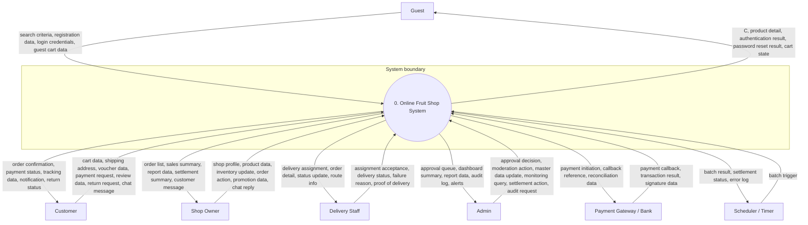

# Phan tich Actor va Functional Requirements
## Online Fruit Shop System

**Nguon tham chieu:** Chi dua tren tai lieu SRS va Section 3 Functional Requirements. Khong dua tren source code hay cau truc project.

---

## 1. Muc dich

Tai lieu nay chuyen cac functional requirements trong SRS thanh danh sach actor, pham vi chuc nang, va quy tac nghiep vu can giu dung khi thiet ke hoac trien khai tinh nang. Muc tieu la giup xay dung chuc nang ro rang, dong bo, va khong bo sot vai tro nao trong he thong.

---

## 2. Tong quan actor

### 2.1 Nhom actor chinh

| Actor | Loai actor | Muc tieu chinh | Nhom chuc nang chinh |
| --- | --- | --- | --- |
| Guest | Nguoi dung | Tim kiem san pham, xem thong tin, dang ky hoac dang nhap, tao gio hang tam thoi | Authentication, Product Discovery, Guest Cart |
| Customer | Nguoi dung | Mua hang, thanh toan, theo doi don hang, review, return/exchange, chat voi shop | Cart, Checkout, Payment, Tracking, After-sales |
| Shop Owner | Nguoi dung | Quan ly shop, san pham, ton kho, don hang, chat, khuyen mai, dashboard, settlement | Shop Management, Order Processing, Reporting |
| Delivery Staff | Nguoi dung | Xu ly giao hang duoc phan cong va cap nhat trang thai giao hang | Delivery Management |
| Admin | Nguoi dung | Quan tri he thong, phe duyet shop, moderation, monitoring, master data, audit | Administration, Monitoring, Settlement |

### 2.2 Nhom actor ngoai he thong

| Actor | Loai actor | Vai tro trong he thong | Nguon SRS |
| --- | --- | --- | --- |
| Payment Gateway / Bank | He thong ngoai | Gui webhook xac nhan thanh toan, cap nhat trang thai giao dich | Payment Processing, Payment Webhook |
| Scheduler / Timer | Timer / job trigger | Kich hoat job dinh ky cho settlement batch | Settlement Batch Job |

### 2.3 Ghi chu phan loai

- Guest, Customer, Shop Owner, Delivery Staff, va Admin la cac actor nguoi dung chinh.
- Payment Gateway / Bank va Scheduler / Timer khong phai nguoi dung, nhung la actor ben ngoai can duoc mo ta trong functional requirements.
- Cac service noi bo nhu Cart Synchronization Service, Inventory Reservation Service, Notification Service, va Recommendation Service la bo phan ho tro cua he thong, khong nen coi la actor doc lap. Chung can duoc lien ket voi actor tuong ung.

---

## 3. Ma tran actor - functional area

| Functional area | Guest | Customer | Shop Owner | Delivery Staff | Admin | Payment Gateway / Bank | Scheduler / Timer |
| --- | --- | --- | --- | --- | --- | --- | --- |
| Authentication | X | X | X | X | X |  |  |
| Product Discovery | X | X | X | X | X |  |  |
| Guest Cart | X |  |  |  |  |  |  |
| Cart / Checkout |  | X |  |  |  |  |  |
| Payment / Tracking |  | X |  |  | X | X |  |
| Shop Registration / Profile |  | X | X |  | X |  |  |
| Product / Inventory Management |  |  | X |  | X |  |  |
| Order Processing |  |  | X |  | X |  |  |
| Delivery Management |  |  |  | X | X |  |  |
| Chat |  | X | X |  |  |  |  |
| Review / Return / Exchange |  | X |  |  | X |  |  |
| Promotion / Recommendation | X | X | X |  | X |  |  |
| Dashboard / Reporting |  |  | X |  | X |  |  |
| Settlement / Payout |  |  | X |  | X |  | X |
| Audit / Monitoring / Master Data |  |  |  |  | X |  |  |

---

## 4. Phan tich chi tiet theo actor

### 4.1 Guest

**Muc tieu**
- Xem san pham, tim kiem, loc, xem chi tiet.
- Tao tai khoan, dang nhap, hoac khoi phuc mat khau.
- Tao gio hang tam thoi truoc khi dang nhap.

**Chuc nang SRS lien quan**
- Home Page
- Product Listing Page
- Product Detail Page
- Search / Filter Panel Function
- Register Page
- Login Page
- Forgot Password Page
- Guest Cart Page
- Guest Cart Storage Function
- Recommendation block / featured products

**Quy tac nghiep vu can giu**
- Chi hien san pham active.
- Gio hang guest phai nam o localStorage hoac sessionStorage.
- Neu guest checkout khong duoc ho tro, phai co loi dan ro rang sang dang nhap.
- Dang nhap phai xu ly lockout, email verification, va thong bao loi ro rang.

**Muc uu tien xay dung**
- P1. Day la lop vao he thong, can co som nhat.

### 4.2 Customer

**Muc tieu**
- Mua hang day du: gio hang, checkout, thanh toan, theo doi don.
- Tiep tuc su dung cac tinh nang sau ban hang: review, return/exchange, chat.
- Co the gui shop registration request neu SRS cho phep.

**Chuc nang SRS lien quan**
- Customer Cart Page
- Checkout Page
- Order Confirmation Page
- Payment Page
- Payment Webhook Function
- Order History Page
- Order Detail / Tracking Page
- Return / Exchange Request Page
- Product Review Page
- Chat Inbox Page
- Shop Registration Page

**Quy tac nghiep vu can giu**
- Checkout chi duoc tao don cho mot shop owner.
- Ton kho phai duoc kiem tra va reservation truoc khi xac nhan don.
- Review chi duoc tao sau khi don hoan thanh.
- Return / exchange chi duoc tao trong cua so thoi gian cho phep.
- Chat phai lien ket dung shop hoac don hang.

**Muc uu tien xay dung**
- P1 cho checkout, payment, tracking.
- P2 cho after-sales va chat.

### 4.3 Shop Owner

**Muc tieu**
- Quan ly shop, san pham, variants, ton kho, don hang, khuyen mai, settlement.
- Nhan va xu ly chat voi customer.
- Xem dashboard va report van hanh.

**Chuc nang SRS lien quan**
- Shop Registration Page
- Shop Profile Page
- Product List Page
- Product Create / Edit Page
- Product Variant / Image Management Page
- Inventory Management Page
- Order Management Page
- Chat Inbox Page
- Promotion Management Page
- Shop Dashboard Page
- Shop Report Page
- Settlement Dashboard Page

**Quy tac nghiep vu can giu**
- Chi duoc lam viec tren du lieu thuoc shop cua minh.
- SKU phai unique, stock phai cap nhat bang inventory log.
- Product inactive khong duoc xuat hien tren storefront.
- Handover don hang phai bi chan neu thanh toan chua hoan tat.
- Settlement chi duoc tinh va dong sau complaint window.

**Muc uu tien xay dung**
- P2. Sau khi dong chuc nang mua hang co ban.

### 4.4 Delivery Staff

**Muc tieu**
- Nhan don duoc assign.
- Cap nhat trang thai giao hang theo quy trinh cho phep.
- Bao cao that bai giao hang khi co ly do ro rang.

**Chuc nang SRS lien quan**
- Delivery Dashboard Page
- Delivery Status Update Function
- Order Detail / Tracking Page

**Quy tac nghiep vu can giu**
- Chi duoc xem cac don duoc phan cong.
- Chi duoc cap nhat trang thai hop le trong workflow.
- FAILED phai co failure_reason.
- Reverse transition bi chan neu khong hop le theo business rule.

**Muc uu tien xay dung**
- P2. Can co sau order flow nhung truoc mo rong van hanh lon.

### 4.5 Admin

**Muc tieu**
- Quan tri toan bo he thong va giam sat cac tinh trang bat thuong.
- Phe duyet shop, moderation product, quan ly user, category, settlement, setting, audit log.

**Chuc nang SRS lien quan**
- Admin Dashboard Page
- User Management Page
- User Detail Page
- Shop Approval Queue Page
- Shop Approval Detail Page
- Category Management Page
- Product Moderation Page
- Order Monitoring Page
- Payment Monitoring Page
- Settlement Management Page
- Report Dashboard Page
- System Notification Page
- Audit Log Page
- Setting List Page
- Setting Detail Page

**Quy tac nghiep vu can giu**
- Tat ca hanh dong nhay cam phai duoc audit log.
- Rejection, hide, suspend, va cac thao tac moderating khac phai co ly do khi can.
- Khong duoc cap quyen vuot qua policy.
- Data monitoring phai dung voi trang thai that cua he thong.

**Muc uu tien xay dung**
- P2 cho cac chuc nang quan tri cot loi.
- P3 cho bo sung bao cao, thong bao, va master data sau.

### 4.6 Payment Gateway / Bank

**Muc tieu**
- Gui ket qua thanh toan ve he thong.
- Ho tro dong bo trang thai giao dich.

**Chuc nang SRS lien quan**
- Payment Webhook Function
- Payment Monitoring Page
- Payment Page

**Quy tac nghiep vu can giu**
- Webhook phai idempotent.
- Duplicate webhook phai bi phat hien va xu ly an toan.
- Raw payload phai duoc luu de audit va reconciliation.

**Muc uu tien xay dung**
- P1 neu payment online la core flow.

### 4.7 Scheduler / Timer

**Muc tieu**
- Kich hoat settlement batch theo dinh ky.
- Dam bao settlement chi chay khi du dieu kien.

**Chuc nang SRS lien quan**
- Settlement Batch Job
- Payout Confirmation Function
- Settlement Dashboard Page

**Quy tac nghiep vu can giu**
- Job chi chay khi data da eligible.
- Neu job that bai, phai co retry hoac alert.
- Ket qua phai dong bo voi settlement dashboard.

**Muc uu tien xay dung**
- P3, sau khi order va payout flow on dinh.

---

## 5. Nhom non-UI support functions va actor phu thuoc

| Support function | Phuc vu actor nao | Vai tro |
| --- | --- | --- |
| Cart Synchronization Service | Guest, Customer | Dong bo gio hang tam thoi sang gio hang da dang nhap |
| Inventory Reservation Service | Customer, Shop Owner | Giu ton kho khi checkout va hoan lai khi huy/that bai |
| Notification Service | Customer, Shop Owner, Delivery Staff, Admin | Tao thong bao he thong theo su kien |
| Recommendation Service | Guest, Customer | De xuat san pham theo lich su va seasonality |
| Payment Webhook Function | Customer, Admin | Cap nhat trang thai thanh toan tu ben ngoai |
| Settlement Batch Job | Shop Owner, Admin | Tinh settlement dinh ky sau complaint window |

---

## 6. Thu tu xay dung de chuc nang hoan chinh va chinh chu

### Giai doan 1 - Nen tang
1. Authentication va phan quyen.
2. Product Discovery: home, listing, detail, search/filter.
3. Category va du lieu hien thi co ban.

### Giai doan 2 - Commerce core
1. Guest Cart va Customer Cart.
2. Checkout mot shop, sinh order code, reservation ton kho.
3. Payment, webhook, order history, tracking.

### Giai doan 3 - Merchant operations
1. Shop registration va shop profile.
2. Product CRUD, variant, image, inventory.
3. Order management, chat, promotion.
4. Dashboard va report co ban.

### Giai doan 4 - Fulfillment va after-sales
1. Delivery dashboard va status update.
2. Review.
3. Return / exchange.

### Giai doan 5 - Governance va settlement
1. User management, shop approval, category management.
2. Product moderation, monitoring, audit log.
3. Settlement dashboard, payout confirmation, settlement batch job.

---

## 7. Cac quy tac nghiep vu can giu chat de tranh sai pham vi

- Mot order chi thuoc ve mot shop owner.
- Guest cart phai la tam thoi va khong thay the customer cart.
- Delivery staff la actor rieng, khong gan vao vai tro customer hoac shop owner.
- Review chi duoc tao sau khi don hoan thanh.
- Settlement chi dong sau complaint window.
- Cac thao tac nhay cam phai duoc audit.
- Cac trang thai thanh toan va giao hang phai co workflow ro rang, khong duoc nhay trang thai bat thuong.

---

## 8. Ket luan

Neu muc tieu la xay dung chuc nang day du va sach se, nen xem cac actor tren nhu mot lop contract cho toan bo he thong. Moi tinh nang nen duoc map truc tiep ve mot actor chinh, mot nhom man hinh, va mot nhom rule can biet. Lam theo thu tu uu tien o tren se giup he thong co core commerce vung, sau do moi mo rong sang van hanh, quan tri, va settlement.

---

## 9. Context diagram (standard form)

### 9.1 Context diagram

### 9.2 Main data flows

| External entity | Data into system | Data from system |
| --- | --- | --- |
| Guest | Search criteria, registration data, login credentials, guest cart data | Product catalog, product detail, authentication result, password reset result, cart state |
| Customer | Cart data, shipping address, voucher data, payment request, review data, return request, chat message | Order confirmation, payment status, tracking data, notification, return status |
| Shop Owner | Shop profile, product data, inventory update, order action, promotion data, chat reply | Order list, sales summary, report data, settlement summary, customer message |
| Delivery Staff | Assignment acceptance, delivery status, failure reason, proof of delivery | Delivery assignment, order detail, status update, route info |
| Admin | Approval decision, moderation action, master data update, monitoring query, settlement action, audit request | Approval queue, dashboard summary, report data, audit log, alerts |
| Payment Gateway / Bank | Payment callback, transaction result, signature data | Payment initiation, callback reference, reconciliation data |
| Scheduler / Timer | Batch trigger | Batch result, settlement status, error log |

### 9.3 Rules for a standard context diagram

- Show one system process only, treated as a black box.
- Show only external entities around the system boundary.
- Label flows with data names, not UI steps or internal processing.
- Do not show internal services, tables, controllers, or screen names in the context diagram.
- Keep the diagram at DFD context level, not level 1 or deeper.
