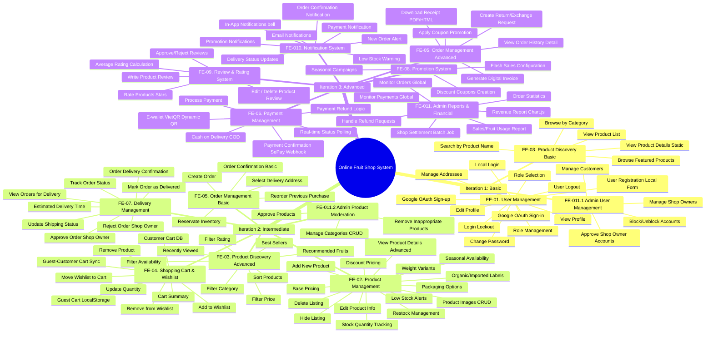

# SRS Feature Tree - Online Fruit Shop System (103 Leaf Features Aligned)

**Reference:** Aligned 100% with the explicit 103 English leaf features from the Special Specialization guidelines and the Professor's Iteration / Interaction mapping.

---

## 1. Development Roadmap (3 Iterations / Interactions)

To facilitate progressive development for student programmers, the system is strictly divided into **3 Interactions (Iterations)** based on business complexity and database operations:

* **Iteration 1 (Authentication, Profile & Basic Discovery)**: Focusing on basic MVC architecture, Session management, and simple `SELECT` operations.
* **Iteration 2 (Product & Order Management)**: Focusing on complex write operations (`INSERT/UPDATE/DELETE`), database relationships, and cart/inventory transactional integrity.
* **Iteration 3 (Payment, Advanced Systems & Dashboards)**: Focusing on third-party webhook integrations (SePay), dynamic QR generation, idempotency protection, automated background scheduling (Batch Jobs), and complex aggregated reporting (Charts/SQL `JOIN`s).

---

## 2. Aligned Feature Tree (Exhaustive English Detail by Interactions)

Below is the non-collapsed listing of all 103 system functionalities mapped precisely into the Professor's three Iterations:

```text
Online Fruit Shop System
│
├─ ITERATION 1: AUTHENTICATION, PROFILE & DISCOVERY
│  ├─ FE-01. User Management (Authentication & Profile)
│  │  ├─ User Registration Local Form
│  │  ├─ Google OAuth Sign-up
│  │  ├─ Role Selection
│  │  ├─ Local Login
│  │  ├─ Google OAuth Sign-in
│  │  ├─ User Logout
│  │  ├─ Login Lockout
│  │  ├─ View Profile
│  │  ├─ Edit Profile
│  │  ├─ Manage Addresses
│  │  ├─ Change Password
│  │  └─ Role Management
│  ├─ FE-03. Product Discovery (Basic UI & Flow)
│  │  ├─ View Product List
│  │  ├─ View Product Details (Static UI)
│  │  ├─ Browse by Category
│  │  ├─ Browse Featured Products
│  │  └─ Search by Product Name
│  └─ FE-011. Admin Management (User Administration)
│     ├─ Manage Customers
│     ├─ Manage Shop Owners
│     ├─ Block/Unblock Accounts
│     └─ Approve Shop Owner Accounts
│
├─ ITERATION 2: PRODUCT & ORDER MANAGEMENT
│  ├─ FE-02. Product Management (Shop Owner & Admin Moderation)
│  │  ├─ Add New Product
│  │  ├─ Edit Product Info
│  │  ├─ Delete Listing
│  │  ├─ Hide Listing
│  │  ├─ Product Images CRUD
│  │  ├─ View Product Details (Advanced)
│  │  ├─ Weight Variants
│  │  ├─ Packaging Options
│  │  ├─ Organic/Imported Labels
│  │  ├─ Seasonal Availability
│  │  ├─ Stock Quantity Tracking
│  │  ├─ Low Stock Alerts
│  │  ├─ Restock Management
│  │  ├─ Base Pricing
│  │  └─ Discount Pricing
│  ├─ FE-03. Product Discovery (Advanced Browsing & Search)
│  │  ├─ Filter Category
│  │  ├─ Filter Price
│  │  ├─ Filter Rating
│  │  ├─ Filter Availability
│  │  ├─ Sort Products
│  │  ├─ Recommended Fruits
│  │  ├─ Best Sellers
│  │  └─ Recently Viewed
│  ├─ FE-04. Shopping Cart & Wishlist
│  │  ├─ Guest Cart LocalStorage
│  │  ├─ Customer Cart DB
│  │  ├─ Guest-Customer Cart Sync
│  │  ├─ Update Quantity
│  │  ├─ Remove Product
│  │  ├─ Cart Summary
│  │  ├─ Add to Wishlist
│  │  ├─ Remove from Wishlist
│  │  └─ Move Wishlist to Cart
│  ├─ FE-05. Order Management (Checkout & Flow)
│  │  ├─ Select Delivery Address
│  │  ├─ Order Confirmation (Basic Checkout)
│  │  ├─ Create Order
│  │  ├─ Reservate Inventory
│  │  └─ Reorder Previous Purchase
│  ├─ FE-07. Delivery Management
│  │  ├─ Track Order Status
│  │  ├─ Estimated Delivery Time
│  │  ├─ Order Delivery Confirmation
│  │  ├─ View Orders for Delivery
│  │  ├─ Update Shipping Status
│  │  ├─ Approve Order Shop Owner
│  │  ├─ Reject Order Shop Owner
│  │  └─ Mark Order as Delivered
│  └─ FE-011. Admin Management (Product Moderation)
│     ├─ Approve Products
│     ├─ Remove Inappropriate Products
│     └─ Manage Categories CRUD
│
└─ ITERATION 3: PAYMENT, REPORTS, REVIEWS, NOTIFICATIONS & ADMIN
   ├─ FE-06. Payment Management (SePay Webhook & Auto Confirmation)
   │  ├─ Cash on Delivery COD
   │  ├─ E-wallet VietQR Dynamic QR
   │  ├─ Process Payment
   │  ├─ Payment Confirmation SePay Webhook
   │  ├─ Real-time Status Polling
   │  └─ Payment Refund Logic
   ├─ FE-05. Order Management (Advanced Order)
   │  ├─ Apply Coupon Promotion
   │  ├─ Generate Digital Invoice
   │  ├─ Download Receipt PDF/HTML
   │  ├─ Create Return/Exchange Request
   │  └─ View Order History Detail
   ├─ FE-08. Promotion System
   │  ├─ Discount Coupons Creation
   │  ├─ Seasonal Campaigns
   │  └─ Flash Sales Configuration
   ├─ FE-09. Review & Rating System
   │  ├─ Write Product Review
   │  ├─ Edit / Delete Product Review
   │  ├─ Rate Products Stars
   │  ├─ Average Rating Calculation
   │  └─ Approve/Reject Reviews
   ├─ FE-010. Notification System
   │  ├─ Order Confirmation
   │  ├─ Payment Notification
   │  ├─ Delivery Status Updates
   │  ├─ Promotion Notifications
   │  ├─ Low Stock Warning
   │  ├─ New Order Alert
   │  ├─ Email Notifications
   │  └─ In-App Notifications bell
   └─ FE-011. Admin Management (Reports & Settlement)
      ├─ Monitor Orders Global
      ├─ Monitor Payments Global
      ├─ Handle Refund Requests
      ├─ Revenue Report Chart.js
      ├─ Sales/Fruit Usage Report
      ├─ Order Statistics
      └─ Shop Settlement Batch Job
```

---

## 3. Mermaid Mindmap Aligned


