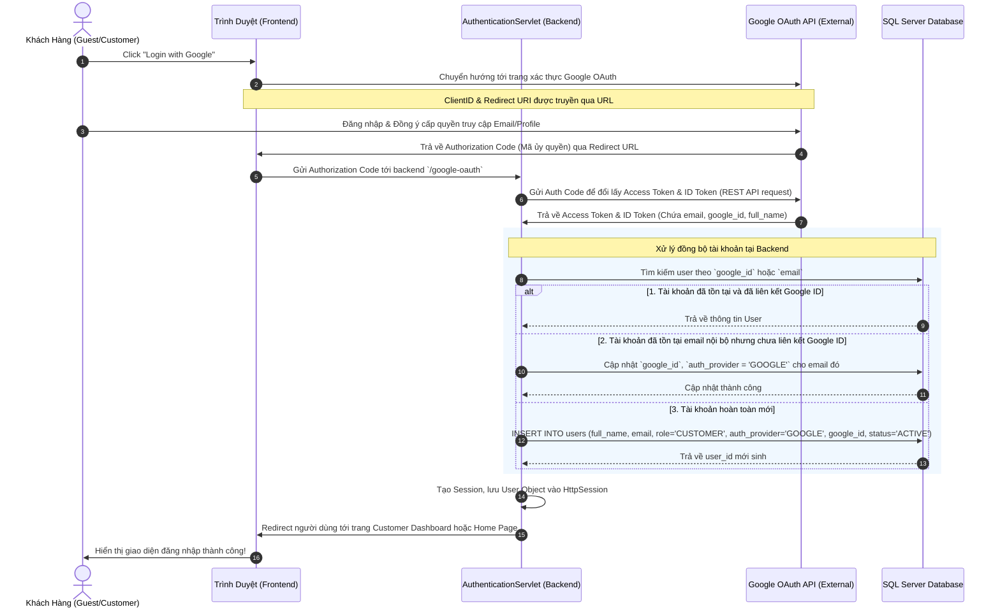

# HƯỚNG DẪN TỔ CHỨC DỰ ÁN, KIẾN TRÚC XÁC THỰC (AUTH & GOOGLE OAUTH) VÀ PHÂN CHIA CÔNG VIỆC NHÓM (ITERATION 1, 2, 3)
## Dự án: Hệ Thống Bán Hoa Quả Online (Online Fruit Shop System)
### Tài Liệu Chuẩn Dành Cho Nhóm Sinh Viên Đại Học

---

## 🛠 Lời Nói Đầu & Quản Trị Nhóm Sinh Viên
Chào các bạn sinh viên! Làm việc nhóm trong một dự án công nghệ (đặc biệt là đồ án môn học Công nghệ phần mềm, Hệ quản trị CSDL, hoặc Phát triển ứng dụng Web) thường gặp các thách thức: *xung đột code Git, phân chia công việc không đều, chồng chéo chức năng, hoặc không biết bắt đầu từ đâu*.

Tài liệu này được biên soạn tỉ mỉ nhằm giúp nhóm của bạn giải quyết các vấn đề trên thông qua:
1. **Kiến trúc Auth chuẩn chỉ**: Phân rã luồng xác thực nội bộ (Local Auth) và **tích hợp Google OAuth** để tăng trải nghiệm khách hàng.
2. **Kế hoạch 3 Iterations thực tế**: Tập trung vào những phần cốt lõi có thể lập trình thực tế (codeable screens), loại bỏ mơ hồ lý thuyết.
3. **Ma trận phân công công việc (5 vai trò thực tế)**: Phân rõ trách nhiệm từng người để tránh tình trạng "người làm không hết việc, người ngồi chơi".
4. **Hướng dẫn Git & Kỹ thuật Servlet/JSP (Tomcat 10 / NetBeans / Java 25)**: Giúp các thành viên ráp code mượt mà.

---

## 🔐 PHẦN 1: KIẾN TRÚC XÁC THỰC TOÀN DIỆN (AUTHENTICATION ARCHITECTURE)

Hệ thống của chúng ta sử dụng kiến trúc phân quyền dựa trên vai trò (**RBAC - Role-Based Access Control**).
Có 4 vai trò chính được lưu trong DB: `CUSTOMER`, `SHOP_OWNER`, `DELIVERY`, `ADMIN`. Khách truy cập chưa đăng nhập được coi là `GUEST`.

### 1.1 Sơ Đồ Cấu Trúc Nhánh Auth (Sau Khi Thêm Google OAuth)
Nhánh Auth của chúng ta sẽ được tổ chức như sau:
```text
Authentication
├── Local Authentication (Xác thực nội bộ bằng Email & Password)
│   ├── Register Page (Đăng ký tài khoản Customer/Shop Owner)
│   ├── Login Page (Đăng nhập hệ thống)
│   ├── Forgot Password Page (Khôi phục mật khẩu qua Email OTP)
│   └── Login Lockout Function (Khóa tài khoản tạm thời nếu nhập sai pass quá 5 lần)
├── Social Authentication (Mới bổ sung)
│   └── Google OAuth 2.0 (Đăng ký / Đăng nhập nhanh bằng tài khoản Google)
└── Account Integration (Tích hợp tài khoản)
    └── Account Linking Function (Liên kết tài khoản Google với tài khoản Local qua Email trùng khớp)
```

---

### 1.2 Luồng Hoạt Động Của Google OAuth 2.0 (Sequence Diagram)
Dưới đây là sơ đồ tuần tự thể hiện cách hệ thống Servlet/JSP (Tomcat) giao tiếp với Google API và Database khi người dùng click nút "Đăng nhập bằng Google":



---

### 1.3 Thiết Kế Database Cho Nhánh Auth (Database Schema Impact)
Để hỗ trợ Google OAuth và liên kết tài khoản an toàn, bảng `users` hiện tại trong file Schema.sql cần được bổ sung thêm một số cột.

#### [MODIFY] Bảng `users` trong CSDL
```sql
ALTER TABLE users ADD 
    auth_provider NVARCHAR(20) NOT NULL DEFAULT 'LOCAL' CHECK (auth_provider IN ('LOCAL', 'GOOGLE')),
    google_id NVARCHAR(255) NULL UNIQUE;
```
* **`auth_provider`**: Xác định tài khoản này được tạo theo phương thức nào (`LOCAL` - mật khẩu thông thường, hoặc `GOOGLE` - đăng nhập mạng xã hội).
* **`google_id`**: Lưu Subject ID (chuỗi định danh duy nhất của Google cấp cho người dùng) để đối soát đăng nhập nhanh, tránh bị giả mạo email.

---

### 1.4 Giải Pháp Bảo Mật Nhánh Auth (Session Security & Filters)
Đối với đồ án Java Web Servlet/JSP, **Security Filter** là chốt chặn quan trọng nhất để phân quyền, tránh việc người dùng gõ trực tiếp URL vào các thư mục quản trị mà không qua đăng nhập.

#### Cấu trúc chốt chặn URL (Authorization Filter):
* **`/customer/*`**: Chỉ cho phép người dùng có `role = 'CUSTOMER'` truy cập.
* **`/shop/*`**: Chỉ cho phép người dùng có `role = 'SHOP_OWNER'` truy cập.
* **`/delivery/*`**: Chỉ cho phép người dùng có `role = 'DELIVERY'` truy cập.
* **`/admin/*`**: Chỉ cho phép người dùng có `role = 'ADMIN'` truy cập.
* **`/WEB-INF/jsp/`**: Toàn bộ trang JSP **phải** được đặt dưới thư mục `WEB-INF`. Đây là cấu trúc bảo mật tuyệt đối của Java Servlet, trình duyệt không thể truy cập trực tiếp file JSP mà bắt buộc phải đi qua Controller (Servlet) để `RequestDispatcher.forward()`.

---

## 🗂 PHẦN 2: CẬP NHẬT FEATURE TREE & HƯỚNG DẪN SỬA FILE PDF
Do file PDF `docs/3. Feature Tree  - Online Fruit Shopping - sent.pdf` là file định dạng nhị phân đã biên dịch, nhóm của bạn **không nên** tìm cách chỉnh sửa trực tiếp bằng code (dễ gây lỗi cấu trúc file). 

### 2.1 Hướng Dẫn Chỉnh Sửa File PDF Vẽ Bằng Tay/Công Cụ:
1. Mở sơ đồ thiết kế gốc của nhóm bạn trên các công cụ như **Draw.io**, **Lucidchart**, hoặc **Figma**.
2. Tìm tới nhánh **Authentication**.
3. Thực hiện kéo thêm các box chức năng mới dưới nhánh `Authentication -> Account Access`:
   * Thêm box: **Google OAuth (Sign-in / Sign-up)**.
   * Thêm box: **Account Integration** nằm song song với `Account Access` và `Session Security`.
   * Dưới `Account Integration`, vẽ một box con: **Account Linking Function (Merge by Email/Google ID)**.
4. Xuất file thiết kế mới ra định dạng PDF đè lên file cũ, hoặc lưu dưới dạng `3. Feature Tree - Updated.pdf` trong thư mục `docs/`.

### 2.2 Sơ Đồ Mermaid Feature Tree Mới (Sử dụng để nhúng trực tiếp vào Báo cáo Đồ án):
Nhóm bạn có thể copy đoạn code Mermaid dưới đây để dán vào file báo cáo Markdown hoặc tài liệu Word (hỗ trợ Mermaid):

```text
Online Fruit Shop System
├─ Authentication [Guest, Customer, Shop Owner, Delivery Staff, Admin]
│  ├─ Account Access
│  │  ├─ Register Page (Đăng ký tài khoản)
│  │  ├─ Login Page (Đăng nhập)
│  │  ├─ Forgot Password Page (Quên mật khẩu)
│  │  └─ Google OAuth Sign-in / Sign-up (Mới bổ sung)
│  ├─ Account Integration (Mới bổ sung)
│  │  └─ Account Linking Function (Liên kết tài khoản Google & Local)
│  └─ Session Security
│     └─ Login Lockout Function (Khóa tài khoản khi đăng nhập sai nhiều lần)
├─ Cart and Checkout [Guest, Customer]
│  ├─ Guest Cart (Giỏ hàng tạm thời)
│  ├─ Guest Checkout Page (Khách không đăng nhập vẫn mua được hàng - Mới bổ sung)
│  ├─ Customer Cart Page (Giỏ hàng chính thức)
│  ├─ Checkout Page (Thanh toán đơn hàng)
│  └─ Order Confirmation Page (Xác nhận đơn hàng)
```

---

## 📈 PHẦN 3: KẾ HOẠCH TRIỂN KHAI PHÂN KỲ (ITERATIONS 1, 2, 3)

Để đảm bảo dự án chạy được thực tế và khớp với mô hình quản trị đồ án chuẩn (như ảnh Excel tham chiếu), chúng ta chia quá trình phát triển làm 3 Iterations tập trung vào các chức năng thực tế có thể lập trình (codeable):

```text
Hệ thống bán hoa quả online (Online Fruit Shop System)
├── Iteration 1: Quản Lý Người Dùng & Xác Thực (User Profile & Authentication)
│   ├── User Registration (Local & Google OAuth Sign-up)
│   ├── User Login / Logout (Local & Google OAuth Sign-in)
│   ├── Change Password (Đổi mật khẩu & Quên mật khẩu)
│   └── View / Update Profile (Xem/Cập nhật thông tin cá nhân)
├── Iteration 2: Danh Mục Sản Phẩm & Luồng Đặt Hàng (Catalog & Ordering Flow)
│   ├── Add New Product (Thêm sản phẩm mới)
│   ├── Edit Product Information (Sửa thông tin sản phẩm)
│   ├── Delete Product Listing (Ngưng bán/Xóa sản phẩm)
│   ├── Search Products (Tìm kiếm sản phẩm)
│   ├── Filter Products (Lọc sản phẩm theo danh mục, giá, khu vực shop...)
│   ├── View Product Details (Xem chi tiết sản phẩm và các variants)
│   ├── Request Order (Đặt hàng - Checkout/Giỏ hàng của Guest & Customer)
│   ├── Approve Order (Chủ shop xác nhận đơn hàng)
│   ├── Reject Order (Chủ shop từ chối/hủy đơn)
│   ├── Cancel Order (Khách hàng / Admin hủy đơn)
│   ├── Track Order Status (Theo dõi hành trình đơn hàng)
│   └── View Order History (Xem lịch sử mua hàng)
└── Iteration 3: Thanh Toán, Báo Cáo & Phản Hồi (Payments, Reports & Feedback)
    ├── Process Payment (Thực hiện thanh toán - SePay QR Code & Webhook)
    ├── Select Payment Method (Chọn hình thức thanh toán: Chuyển khoản, COD)
    ├── Record Payment Date & Amount (Ghi nhận thông tin giao dịch ngân hàng thực tế)
    ├── View Payment Status (Xem trạng thái thanh toán: pending, completed, failed, expired)
    ├── Revenue Report (Báo cáo doanh thu cho Shop Owner & Admin)
    ├── Sales/Fruit Usage Report (Báo cáo sản lượng bán ra, thống kê kho hàng)
    ├── Order Statistics (Thống kê đơn hàng: Daily / Weekly / Monthly)
    └── Feedback & After-Sales (Đánh giá sản phẩm - Reviews & Yêu cầu đổi trả/hoàn tiền)
```

---

### 3.1 Iteration 1: Quản Lý Người Dùng & Xác Thực (User Profile & Authentication)
* **Mục tiêu**: Hoàn thiện toàn bộ hạ tầng bảo mật, quản lý tài khoản và tích hợp Google OAuth cho tất cả vai trò.
* **Các màn hình thực tế cần code**:
  1. **Login Page**: Giao diện đăng nhập hệ thống, bao gồm nút "Đăng nhập bằng Google".
  2. **Register Page**: Giao diện đăng ký tài khoản (chọn vai trò Customer hoặc Shop Owner).
  3. **ForgotPassword Page**: Nhập email nhận mã OTP khôi phục mật khẩu.
  4. **Change Password Page**: Trang đổi mật khẩu của người dùng sau khi đăng nhập.
  5. **Profile Page**: Màn hình xem và cập nhật thông tin cá nhân (họ tên, sđt, địa chỉ mặc định).

### 3.2 Iteration 2: Danh Mục Sản Phẩm & Luồng Đặt Hàng (Catalog & Ordering Flow)
* **Mục tiêu**: Xây dựng toàn bộ phân hệ trưng bày sản phẩm của các cửa hàng và quy trình đặt hàng từ giỏ hàng (Guest & Customer) cho tới khi hoàn tất chu trình đơn.
* **Các màn hình thực tế cần code**:
  1. **Home Page & Product Discovery**: Trang chủ và danh sách sản phẩm hiển thị, lọc, tìm kiếm nâng cao.
  2. **Product Detail Page**: Xem thông tin chi tiết sản phẩm, giá bán, chọn biến thể (variants).
  3. **Product CRUD Pages (Shop Owner)**: Giao diện thêm mới, sửa đổi thông tin và ngưng bán sản phẩm của chủ shop.
  4. **Guest & Customer Cart Page**: Giỏ hàng (Guest lưu LocalStorage, Customer lưu CSDL).
  5. **Checkout Page (Guest & Customer)**: Điền thông tin giao hàng và gửi yêu cầu tạo đơn hàng.
  6. **Shop Order Management**: Trang quản lý đơn hàng của chủ shop để xác nhận (Approve) hoặc từ chối (Reject) chuẩn bị đơn.
  7. **Order History & Tracking Page**: Tra cứu lịch sử mua hàng, theo dõi hành trình đơn hàng theo thời gian thực.

### 3.3 Iteration 3: Thanh Toán, Báo Cáo & Phản Hồi (Payments, Reports & Feedback)
* **Mục tiêu**: Hoàn thành cổng thanh toán tự động qua SePay, các báo cáo thống kê chuyên sâu cho chủ shop/admin, hệ thống đánh giá sản phẩm và quy trình đối soát tài chính sàn.
* **Các màn hình thực tế cần code**:
  1. **Payment Page**: Hiển thị QR Code chuyển khoản động của SePay dựa trên mã đơn và số tiền cần thanh toán.
  2. **Payment Status Page**: Trình duyệt cập nhật trạng thái thanh toán thời gian thực (Đang chờ, Thành công, Thất bại, Hết hạn).
  3. **Revenue & Sales Reports**: Biểu đồ báo cáo doanh thu, sản lượng bán ra của shop (Shop Owner) và toàn sàn (Admin).
  4. **Order Statistics Dashboard**: Biểu đồ thống kê số lượng đơn hàng theo Daily/Weekly/Monthly.
  5. **Review Submission Page**: Màn hình đánh giá sản phẩm sau khi đơn hoàn thành.
  6. **Return & Exchange Request Page**: Trang tạo yêu cầu đổi trả, hoàn tiền của khách hàng.
  7. **Admin Settlement Dashboard**: Trang Admin đối soát doanh thu chủ shop theo chu kỳ.

---

## 👥 PHẦN 4: PHÂN CHIA CÔNG VIỆC THỰC TẾ CHO THÀNH VIÊN NHÓM

Dưới đây là sơ đồ ma trận phân bổ công việc chi tiết cho **5 thành viên** tương ứng với 5 vai trò thực tế trong một đội ngũ làm sản phẩm chuyên nghiệp.

| Thành viên | Vai trò thực tế | Nhiệm vụ cốt lõi |
| --- | --- | --- |
| **Sinh viên A** | **Backend Engineer (Team Leader)** | Lập trình logic nghiệp vụ (Service), Controller (Servlet), các API tích hợp (Google OAuth, SePay, Gửi Mail). |
| **Sinh viên B** | **Frontend Engineer (Guest & Customer Flow)** | Phát triển toàn bộ các giao diện người mua (Storefront): Home, Listing, Detail, Giỏ Hàng, Checkout, Tracking. |
| **Sinh viên C** | **Frontend Engineer (Management Flow)** | Phát triển toàn bộ giao diện quản trị: Dashboard của Chủ Shop, trang CRUD Sản phẩm, Dashboard của Shipper và Admin. |
| **Sinh viên D** | **Database & Infrastructure Engineer** | Thiết kế, tối ưu DB SQL Server, viết DAO (Data Access Object), cấu hình Tomcat, quản lý môi trường và CI/CD. |
| **Sinh viên E** | **QA / Tester & Technical Writer** | Lập tài liệu kiểm thử (Test Cases), thực hiện test tự động/thủ công, báo cáo lỗi và viết tài liệu hướng dẫn sử dụng (User Manual). |

---

### 📝 CHI TIẾT CÔNG VIỆC TỪNG ITERATION CHO CÁC THÀNH VIÊN

#### 📅 ITERATION 1: QUẢN LÝ NGƯỜI DÙNG & AUTH (Tuần 1 - Tuần 3)
* **Sinh viên A (Backend - Leader)**:
  * Tạo khung dự án Java Web (MVC) trên NetBeans. Cấu hình file `web.xml`.
  * Viết các Servlet: `LoginServlet`, `RegisterServlet`, `ForgotPasswordServlet`, `ChangePasswordServlet`, `ProfileServlet`.
  * Thiết lập tích hợp **Google OAuth 2.0 Backend**: Tiếp nhận auth code từ frontend, gọi Google API đổi token lấy thông tin User, xử lý logic liên kết tài khoản theo email.
* **Sinh viên B (Frontend Buyer)**:
  * Thiết kế giao diện **Login Page** (bao gồm nút Đăng nhập bằng Google) và **Register Page**.
  * Thiết kế trang xem và cập nhật thông tin cá nhân (**Profile Page**).
* **Sinh viên C (Frontend Management)**:
  * Thiết kế giao diện trang **Change Password** và trang **Forgot Password** (giao diện nhập mã OTP và đổi pass).
  * Xây dựng bộ UI/CSS dùng chung (Design System) bao gồm bảng màu, phông chữ, các nút bấm thống nhất cho toàn dự án.
* **Sinh viên D (Database & Infra)**:
  * Khởi tạo CSDL SQL Server dựa trên file `Schema.sql`, bổ sung các trường `auth_provider`, `google_id`.
  * Viết class kết nối CSDL `DBContext.java` với Connection Pool.
  * Viết lớp `UserDAO.java` chứa các hàm: `getUserByEmail()`, `insertUser()`, `linkGoogleAccount()`, `updateProfile()`, `changePassword()`.
* **Sinh viên E (QA & Writer)**:
  * Viết file đặc tả Test Cases cho toàn bộ luồng Auth (Local Auth & Google OAuth).
  * Kiểm thử thủ công luồng Đăng ký, Đăng nhập, Quên mật khẩu, cập nhật Profile của người dùng.

---

#### 📅 ITERATION 2: DANH MỤC & LUỒNG ĐẶT HÀNG (Tuần 4 - Tuần 6)
* **Sinh viên A (Backend - Leader)**:
  * Viết các Servlet phục vụ tìm kiếm/lọc sản phẩm: `SearchProductServlet`, `FilterProductServlet`.
  * Viết Servlet nghiệp vụ của chủ shop: `AddProductServlet`, `EditProductServlet`, `DeleteProductServlet`.
  * Viết Servlet giỏ hàng `CartServlet` và Servlet đặt hàng `CheckoutServlet` (xử lý transaction trừ tồn kho, tạo order).
  * Viết Servlet cập nhật trạng thái đơn hàng: `ApproveOrderServlet` (Chủ shop xác nhận), `RejectOrderServlet` (Chủ shop hủy), `CancelOrderServlet` (Khách hủy).
* **Sinh viên B (Frontend Buyer)**:
  * Thiết kế **Home Page** và **Product Listing Page** (giao diện tìm kiếm, lọc hoa quả).
  * Thiết kế trang chi tiết sản phẩm (**Product Detail Page**) và trang giỏ hàng (**Cart Page**).
  * Thiết kế trang thanh toán (**Checkout Page**) và trang **Order History / Tracking Page**.
* **Sinh viên C (Frontend Management)**:
  * Thiết kế giao diện chủ shop: Danh sách sản phẩm của cửa hàng (**Product List Page**), trang thêm/sửa sản phẩm (**Product Add/Edit Page**).
  * Thiết kế trang quản lý đơn hàng của chủ shop (**Shop Order Management Page**) để thực hiện duyệt/từ chối đơn hàng.
* **Sinh viên D (Database & Infra)**:
  * Viết `ProductDAO.java` chứa các hàm: `getProducts()`, `searchAndFilterProducts()`, `insertProduct()`, `updateProduct()`, `deleteProduct()`.
  * Viết `OrderDAO.java` chứa các hàm: `insertOrder()`, `updateOrderStatus()`, `getOrdersByUserId()`, `getShopOrders()`.
  * Thiết lập cơ chế Transaction trong Java để đảm bảo việc trừ tồn kho khi tạo đơn hàng được thực hiện an toàn.
* **Sinh viên E (QA & Writer)**:
  * Lập kịch bản kiểm thử luồng Đặt hàng (Giỏ hàng -> Điền thông tin -> Đặt hàng).
  * Viết kịch bản kiểm thử luồng Quản lý sản phẩm (CRUD) của chủ shop.
  * Kiểm thử tính đúng đắn khi thay đổi trạng thái đơn hàng (Customer hủy đơn, Shop duyệt đơn).

---

#### 📅 ITERATION 3: THANH TOÁN, BÁO CÁO & PHẢN HỒI (Tuần 7 - Tuần 9)
* **Sinh viên A (Backend - Leader)**:
  * Thiết lập **SePay Webhook Servlet**: Tiếp nhận callback thanh toán từ SePay, kiểm tra trùng lặp giao dịch ngân hàng qua bảng dedup, cập nhật trạng thái payment và đơn hàng sang `completed` và `CONFIRMED`.
  * Tự động sinh tài khoản và gửi email thông tin đăng nhập cho Guest nếu khách thực hiện Guest Checkout.
  * Viết các Servlet tạo báo cáo doanh thu, sản lượng bán ra, thống kê đơn hàng: `ReportServlet`, `StatisticsServlet`.
  * Viết các Servlet đánh giá sản phẩm: `SubmitReviewServlet`, `ReturnRequestServlet`.
* **Sinh viên B (Frontend Buyer)**:
  * Thiết kế trang hiển thị mã QR thanh toán (**Payment Page**).
  * Thiết kế trang đánh giá sản phẩm (**Review Page**) và trang yêu cầu đổi trả hàng (**Return/Exchange Page**).
* **Sinh viên C (Frontend Management)**:
  * Thiết kế Dashboard báo cáo doanh thu, sản lượng bán ra bằng biểu đồ JS (Chart.js) cho chủ shop (**Shop Dashboard**) và Admin (**Admin Dashboard**).
  * Thiết kế trang thống kê đơn hàng (**Order Statistics Dashboard**) hiển thị biểu đồ Daily/Weekly/Monthly.
  * Thiết kế trang Admin duyệt mở shop và đối soát tài chính sàn (**Admin Settlement Dashboard**).
* **Sinh viên D (Database & Infra)**:
  * Thiết lập các bảng `payment_transactions`, `sepay_webhook_dedup`, `reviews`, `return_requests`, `shop_settlements`.
  * Viết `PaymentDAO.java` (lưu giao dịch, đối soát webhook), `ReviewDAO.java` (lưu đánh giá), `SettlementDAO.java` (chốt doanh thu chủ shop).
  * Thiết lập các Index trên SQL Server để tối ưu truy vấn dữ liệu báo cáo, thống kê quy mô lớn.
* **Sinh viên E (QA & Writer)**:
  * Thực hiện End-to-End Test toàn hệ thống: Từ khách mua hàng -> Webhook thanh toán SePay -> Gửi Mail -> Giao nhận -> Viết đánh giá sản phẩm.
  * Viết tài liệu bàn giao dự án: Hướng dẫn import DB, cài đặt project trên NetBeans và hướng dẫn sử dụng hệ thống.

---

## 💻 PHẦN 5: HƯỚNG DẪN KỸ THUẬT CHO SINH VIÊN (BEST PRACTICES)

### 5.1 Cấu Trúc Dự Án Servlet/JSP Đề Xuất (MVC Pattern)
Để ráp code không bị lỗi, nhóm phải thống nhất cấu trúc thư mục dự án ngay từ đầu:

```text
Ban_hoa_qua_online (Project Root)
├── src
│   └── java
│       ├── controller          (Chứa các Servlet xử lý request như LoginServlet.java)
│       ├── dao                 (Chứa các class tương tác DB như UserDAO.java)
│       ├── model               (Chứa các class thực thể/DTO như User.java, Order.java)
│       ├── service             (Chứa các logic nghiệp vụ phức tạp, tính toán tiền)
│       ├── filter              (Chứa Security Filters phân quyền truy cập)
│       └── utils               (Chứa các helper class: MailUtils.java, HashUtils.java)
└── web
    ├── assets                  (Thư mục chứa css, js, images dùng chung công khai)
    │   ├── css
    │   ├── js
    │   └── images
    └── WEB-INF
        ├── web.xml             (Cấu hình Servlet và Filters của dự án)
        └── jsp                 (Thư mục bảo mật chứa toàn bộ giao diện JSP)
            ├── common          (Header, footer, sidebar dùng chung)
            ├── guest           (Các trang dành cho Khách)
            ├── customer        (Các trang dành cho Người Mua Đã Đăng Nhập)
            ├── shop            (Các trang dành cho Chủ Shop)
            ├── delivery        (Các trang dành cho Shipper)
            └── admin           (Các trang dành cho Admin)
```

---

### 5.2 Quy Tắc Làm Việc Với Git Để Tránh Xung Đột Code (Conflict)
Sinh viên thường gặp ác mộng khi merge code trên Git do nhiều người cùng sửa một file. Hãy tuân thủ quy tắc vàng sau:
1. **Tuyệt đối không bao giờ code trực tiếp trên nhánh `main` hoặc `master`.**
2. Nhánh `main` chỉ chứa code đã chạy ổn định 100%.
3. Mỗi khi làm một tính năng mới, hãy tạo một nhánh phụ từ `main`:
   ```bash
   git checkout main
   git pull origin main
   git checkout -b feature/google-oauth-student-a
   ```
4. Chỉ chỉnh sửa trong phạm vi thư mục/file được phân công. Tránh sửa các file CSS/JS dùng chung mà không báo trước cho nhóm.
5. Sau khi code xong trên nhánh phụ, đẩy lên GitHub và tạo **Pull Request (PR)**.
6. Trưởng nhóm (Student A) hoặc thành viên phụ trách DB (Student D) sẽ review code, nếu không có lỗi xung đột mới cho phép Merge vào `main`.

---

### 5.3 Bộ Quy Tắc Lập Trình An Toàn (Security Safeguards)
1. **Chống SQL Injection**: Tuyệt đối không được cộng chuỗi để tạo câu lệnh SQL. Bắt buộc phải sử dụng `PreparedStatement` và truyền tham số bằng dấu hỏi chấm `?`.
   * *Sai*: `String sql = "SELECT * FROM users WHERE email = '" + email + "'";`
   * *Đúng*: `String sql = "SELECT * FROM users WHERE email = ?"; PreparedStatement ps = conn.prepareStatement(sql); ps.setString(1, email);`
2. **Mã hóa mật khẩu**: Không bao giờ lưu mật khẩu dạng văn bản thuần (plaintext) vào Database. Hãy sử dụng thuật toán băm bảo mật như **BCrypt** hoặc **SHA-256 kèm theo Salt** trước khi lưu.
3. **Chống tấn công XSS**: Khi hiển thị các chuỗi ký tự do người dùng nhập lên màn hình JSP (như tên sản phẩm, đánh giá), luôn sử dụng thẻ JSTL `<c:out value="${...}"/>` để tự động mã hóa các thẻ HTML nguy hiểm, tránh bị chèn mã độc Javascript.

Chúc nhóm của các bạn phối hợp ăn ý và hoàn thành xuất sắc đồ án với điểm số tối đa!
